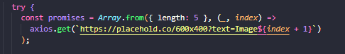
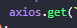
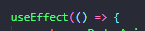
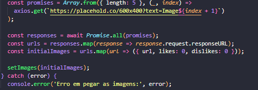
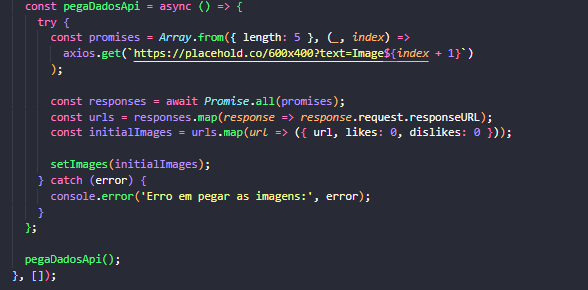
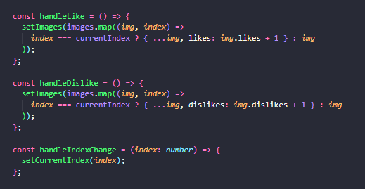

## Projeto Web de Match - Upik

## Descrição
Projeto web de match, onde busca uma api de imagens e o usuário da 
like nas imagens que gosta e dislike nas imagens que não gosta.

Construído utilizando a Biblioteca React, NextJS (framework do react) e o Tailwind para estilizar.

## Instrução de instalação
 Node 20.15.0
 npm install para instalar as dependências
 npm install axios
 npm install react-responsive-carousel

## Informações técnicas do projeto.

# Api
Primeiramente foi lido o teste e criado o projeto (npx create-next-app@latest), logo depois foi fazer 
um get simples com o fetch(get simples nativo do JS) para entender como seria retornada a imagem no site.

Após entender isso, foi criado um array onde foi limitado pelo length em 5 imagens, após entender que retornando 5 
imagens todas estariam com o mesmo nome (600x400) não faria sentido deixar elas assim pois seria confuso e o usuário não iria saber qual imagem seria correspondente.

(foi usado o AXIOS por já possuir familiaridade e por ser mais explícito, mesmo sabendo que o fetch é nativo, mais amigável, mais "humanizado" e mais fácil de entender)

useEffect foi usado para realizar chamada da API. Código a ser executado quando o efeito é disparado.

Cria uma lista de promisses para buscar 5 imagens diferentes, o response para aguardar todas as promisses serem resolvidas e armazenar as respostas.

InitialImages cria um array de objetos ImageData com likes e dislikes inicializados em 0. SetImages atualiza o estado "images"

Assim acaba a função pegaDadosApi.

# Incrementos Likes e Dislikes

Foi criada 3 funções para serem disparadas.

handleLike - onde ele percorre com o map e incrementa em +1 o número de likes da imagem atual.
handleDislike - onde ele percorre com o map e incrementa em +1 o número de dislikes da imagem atual.
e a handleIndexChange - onde atualiza o índice da imagem atualmente exibida.

# Estilização

Inicialmente foi usado um componente em React para visualizar o carrossel, foram setadas suas propriedades, adicionado o handleIndexChange 
e estilizado. Podendo ser utilizado outro componente ou criado o slider puro.

# Considerações finais

Foi um projeto bem interessante, estava acostumado a retornar bastante JSON então esse de imagem foi bem interessante, como eu tive um tempo
maior de produção adicionei alguns itens básicos a mais a fim de melhor usabilidade e responsividade em outros dispositivos e resoluções.

Tentei explicar a lógica e a explicação da minha forma de pensar, porém se houver alguma dúvida ou pergunta, só me chamar.

https://www.figma.com/design/3x7sYDqjxm9J8s48cKEDPH/Teste-Upik?node-id=0-1&t=iEFP6BQabLsvovSw-1
